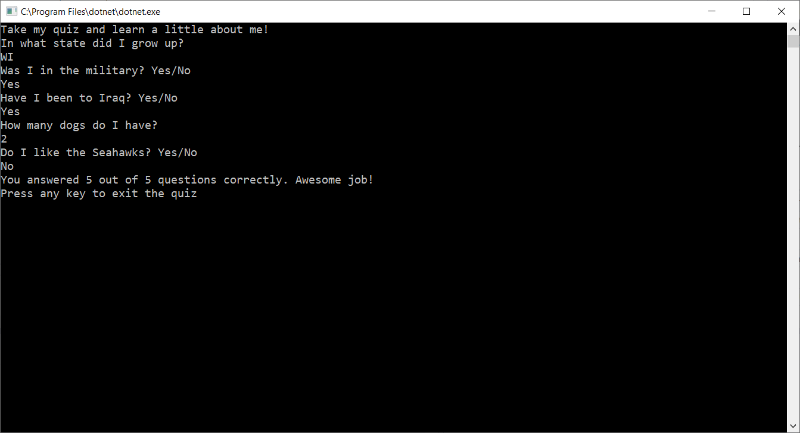

# Lab01-About-Me-Quiz

### Purpose
To create an “About Me” quiz that has at least 5 different questions
to gain practice working with methods and various return types.

### Program Specifications
The solution includes the following:
* Main method
* External methods- (at least 3 non-void return types)
* Different return types
* At least one try/catch/finally implementation

